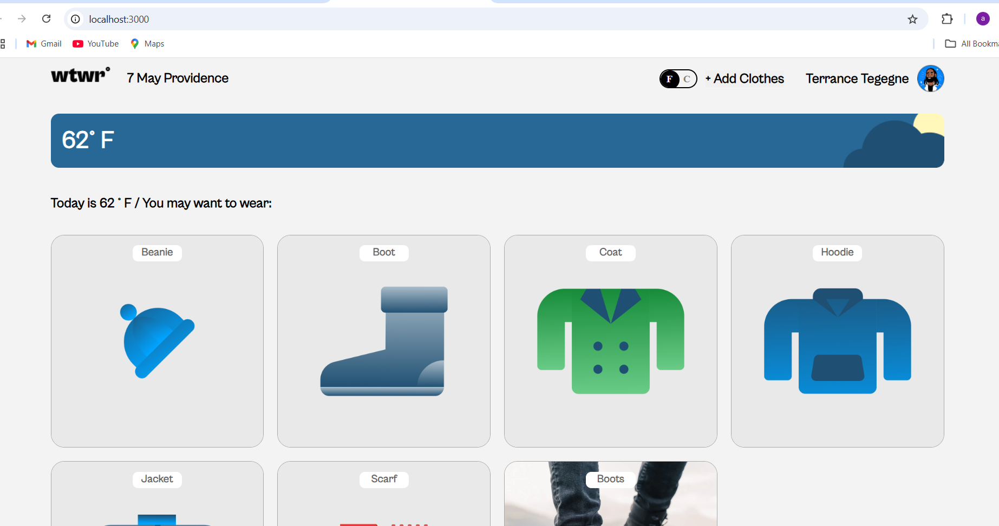
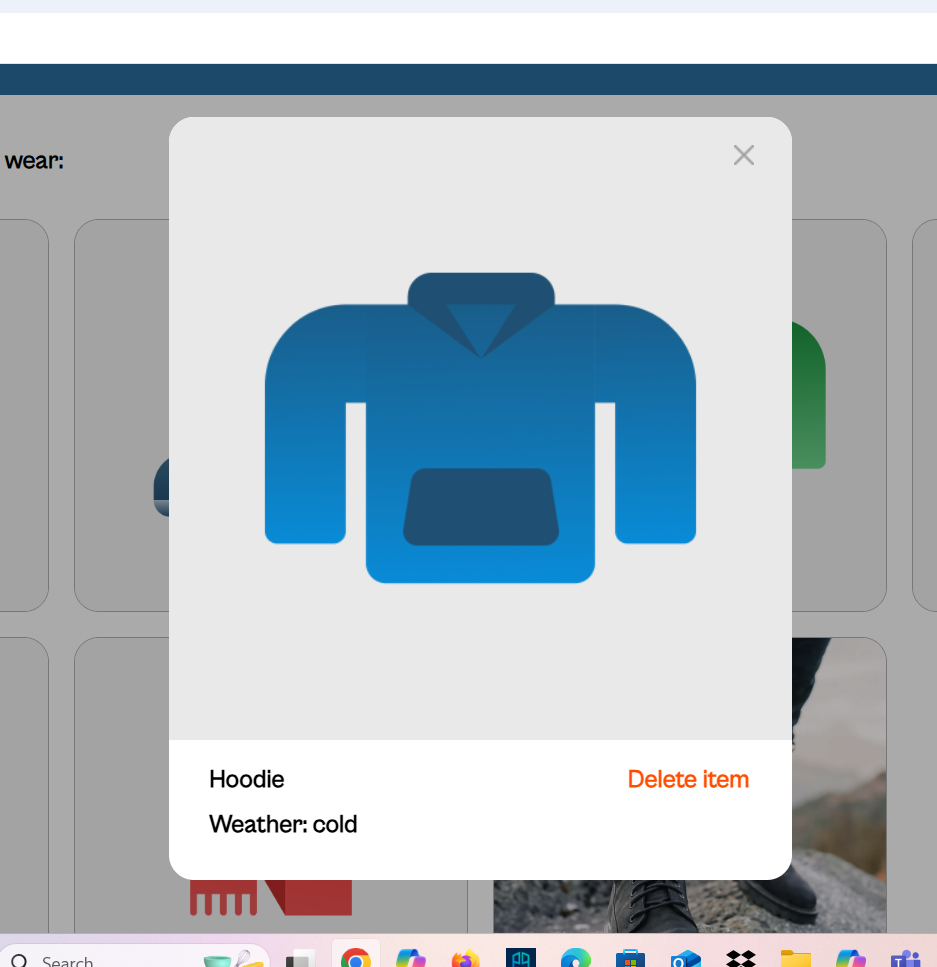
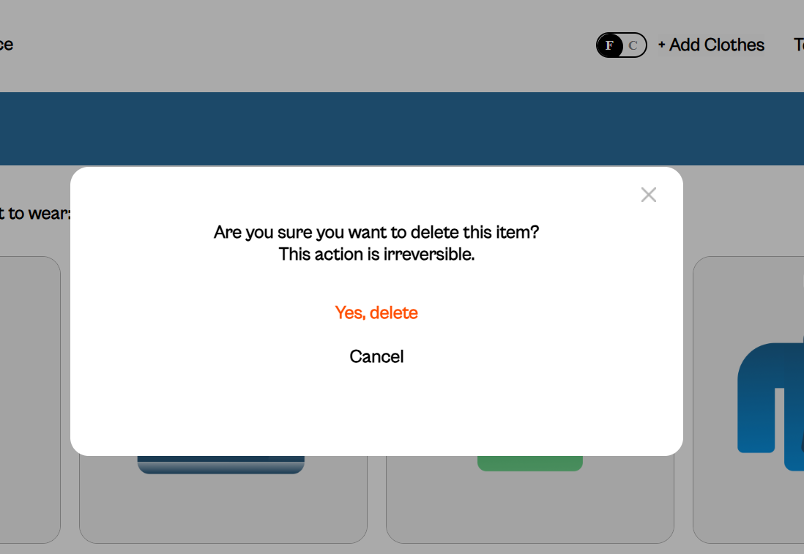
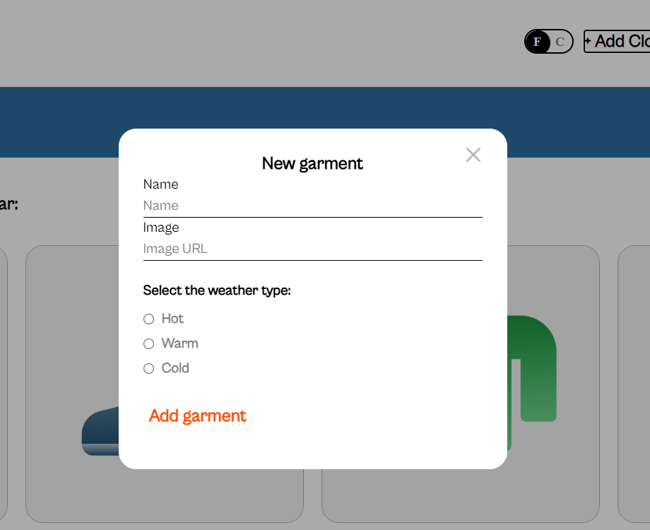

# (WTWR) What To Wear

## About Project And Functionality Description

This project makes an API call when the main component mounts, then fetch the suitable clothes to wear according to the weather, with choices for displaying the unit of measurement in Celsius and Fahrenheit.  Adding clothing images by providing a link within the form and the option to remove them.

## Project Technologies

- React is the primary library utilized, and JSX is used to define the user interface.
- jsx syntax, which is similar to HTML, specifies how your user interface should appear within javascript components.
- CSS was utilized for style.
- executing API calls to temporarily store data on a local JSON file on a mock server that mimics an API.
  
  ## Project Preview

### Screenshot of the homepage

  
  
### All cards are clickable, and will be opened in a preview modal, just like in the screenshot below

  

### You can delete the card by clicking the delete button, then a confirmation modal will open and ask if you are sure about deleting the item, check the pic below

  

### Also you can add new pictures according to the current weather by providing an image link

